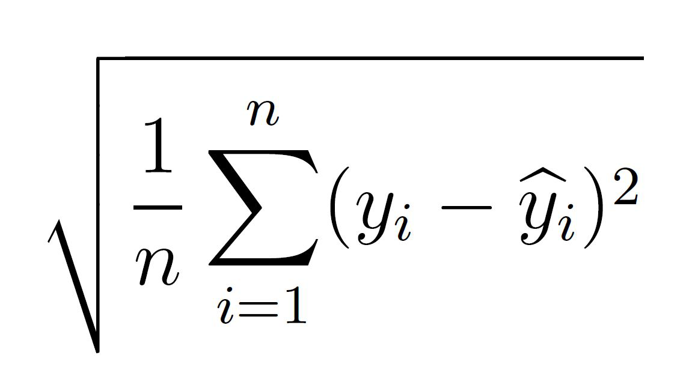
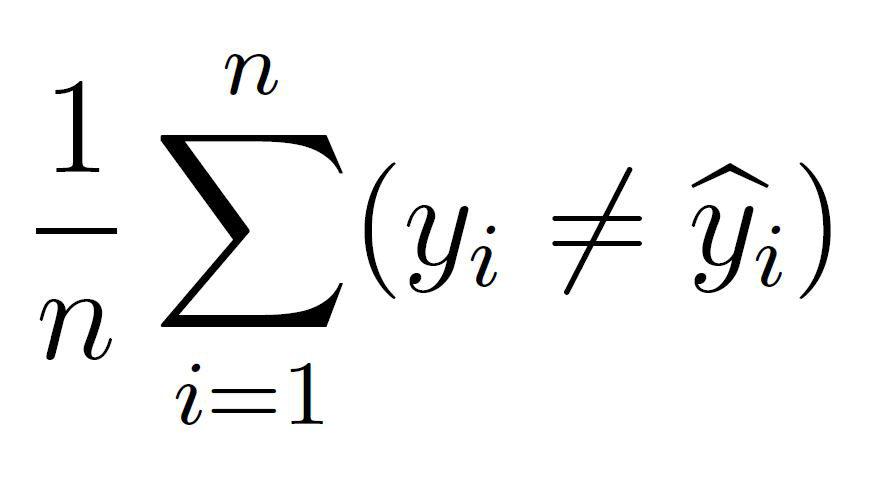
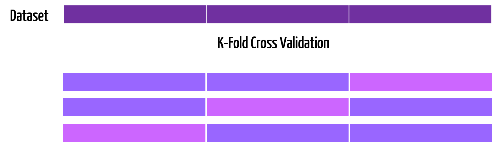
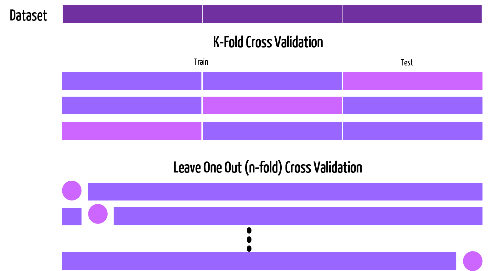

```{r setup, include=FALSE}
options(htmltools.dir.version = FALSE)
library(ggplot2)
library(plotly)
library(dplyr)
livedemosign <- function(top, left, deg) {
  htmltools::div("Live Demo!", class="faa-flash animated",
                 style=glue::glue("border:solid; border-color:black; position:absolute; top:{top}%; left:{left}%; font-size:36px; padding:4px; background-color:white; color:black;transform:rotate({deg}deg);")
                 )
}

```

layout: false
class: bg-main3 split-30 hide-slide-number

.column[

]
.column.slide-in-right[.content.vmiddle[
.sliderbox.shade_main.pad1[
.font5[Welcome!]
]
]]

---

class: split-two white

.column.bg-main1[.content.vmiddle.center[

# Overview

<br>

### This two part R-Ladies workshop is designed to give you a small taster into the large field that is known as .orange[**Machine Learning**]! Last week, we covered supervised learning techniques, and this week we will cover model assessment. 

<br>

### You can always visit last weeks slides at .orange[bit.ly/r-ladies-ML-1] with the corresponding `r icon::fa("github", size=1)` repo [here](https://github.com/sarahromanes/r-ladies-ML-1).

]]
.column.bg-main3[.content.vmiddle.center[


##### [SMBC](https://www.smbc-comics.com/comic/rise-of-the-machines)


]]

---

# .purple[Recap - What *is* Machine Learning?]

<br>

### Machine learning is concerned with finding functions $Y=f(X)+\epsilon$ that best **predict** outputs (responses), given data inputs (predictors).

<br>

<center>

  

</center>

<br>

### Mathematically, Machine Learning problems are simply *optimisation* problems, in which we will use .purple[`r icon::fa("r-project", size=1)`] to help us solve!

---

layout: false
class: bg-main3 split-30 hide-slide-number

.column[

]
.column.slide-in-right[.content.vmiddle[
.sliderbox.shade_main.pad1[
.font5[Performance Metrics]
]
]]

---

class: split-two white 

.column.bg-main1[.content[
<br>

# Regression - revisited 

### Recall the simulated dataset `Income`, which looked at the relationship between `Education` (years) and `Income` (thousands).

```{r}
data <- read.csv("data/Income.csv")
head(data)
```

### How can we assess how well a regression model fits the data?

]]

.column[.content.vmiddle.center[


```{r, fig.retina=4, echo=FALSE}
p <- ggplot(data, aes(x=Education, y=Income))+geom_point(size=3, color="red")  + theme(text = element_text(size=20)) 
p
```


]]

---

class: split-two white 

.column.bg-main1[.content[
<br>

# Is a straight line the best fit?

<br>

<br>

<br>

## Last week we considered fitting a .orange[Linear] model to this data, resulting in the following line...

#### (Revise how this was fit [here](https://sarahromanes.github.io/r-ladies-ML-1/#9).)


]]

.column[.content.vmiddle.center[


```{r, fig.retina=4, echo=FALSE}
p + stat_smooth(method = "lm", se=FALSE)
```


]]

---

class: split-two white 

.column.bg-main1[.content[
<br>

# Is a straight line the best fit?

<br>

<br>

<br>

## ... however there are many types of curves we could have fit to this dataset!

]]

.column[.content.vmiddle.center[


]]


---
class: split-two white 

.column.bg-main1[.content[
<br>

# Is a straight line the best fit?

<br>

<br>

<br>

## ... however there are many types of curves we could have fit to this dataset!

<br>

## Consider now the .orange[*polynomial*] curve of degree 17. Does it fit better than our straight line?

]]

.column[.content.vmiddle.center[


```{r, fig.retina=4, echo=FALSE}
p+ stat_smooth(aes(x = Education, y = Income), method = "lm",
              formula = y ~ poly(x, 17), se = FALSE)
```


]]


---

class: split-two white

.column.bg-main1[.content[

<br>

# Regression metrics: the RMSE

<br>


# The RMSE is the .orange[Root Mean Squared Error], which is a metric of how far away our fitted line lies away from the observations (on average).


]]
.column[.content.vmiddle.center[

]]


---

class: split-60 white

.column.bg-main1[.content[

<br>

# Regression metrics: the RMSE

<br>


```{r}
fit.lm <- lm(data=data, Income~Education)
fit.poly <- lm(data=data, Income~poly(Education, 17))

fitted.vals.lm <- predict(fit.lm, 
                          data.frame(Education=data$Education))
fitted.vals.poly <- predict(fit.poly, 
                            data.frame(Education=data$Education))
```

#### RMSE - Linear Model 
```{r}
sqrt(mean((data$Income-fitted.vals.lm)^2))
```
#### RMSE - Polynomial Model 
```{r}
sqrt(mean((data$Income-fitted.vals.poly)^2)) 
```


]]
.column.bg-main3[.content.vmiddle.center[

## We can find the RMSE of the two models proposed before.


## .orange[The polynomial fit has a lower RMSE. Does this mean we should use it?]

]]


---
# .purple[Bias and Variance]

<br>

## In order to minimise test error on new data points, statistical theory (out of the scope of this workshop) tells us that we need to select a function that achieves *low variance* and *low bias*.

<br>

--

## - .pink[**Variance**] refers to the amount by which our predictions would change if we estimated using a different training set. The more flexible the model, the higher the variance.

--

## - .pink[**Bias**] refers to the error that introduced by the approximation we are making with our model (represent complicated data by a simple model). The more simple the model, the higher the bias.


---

class: middle center bg-main1

# High variance (over fitted) models can be problematic...


---

class: middle center bg-main1

# ... as well as high bias (under fitted) models!


---

# .purple[The Bias-Variance Tradeoff]

<br>

## As you may have guessed, there is a trade off between increasing variance (flexibility) and decreasing bias (simplicity) and vice versa.

<br>

<center>

  

</center>

<br>

### This is known as the .pink[Bias-Variance Tradeoff], and will be revisited in the next section!


---
class: split-two white 

.column.bg-main1[.content[
<br>

# The middle ground!

<br>

## For this dataset, we might consider the `loess` model as a nice middle ground between bias and variance.

```{r}
fit.loess <- loess(data=data, Income~Education) #<<
fitted.vals.loess <- predict(fit.loess,
                             data.frame(
                             Education=data$Education))
rmse.loess <- sqrt(mean((data$Income-fitted.vals.loess)^2)) 
rmse.loess
```


]]

.column[.content.vmiddle.center[


```{r, fig.retina=4, echo=FALSE}
p + stat_smooth(method="loess", se=FALSE)
```


]]

---

class: split-two white 

.column.bg-main1[.content[

<br>

# The classification setting

<br>

### Recall the dataset `Exam`, where two exam scores are given for each student, and a Label represents whether they passed or failed the course.

```{r, fig.retina=4}
data<- read.csv("data/Exam.csv", header=T)
head(data,4)
```


### How do we assess model accuracy for a classifier?
]]

.column[.content.vmiddle.center[
```{r, fig.retina=4, echo=FALSE}
ggplot(data, aes(x=Exam1, y=Exam2, color=factor(Label)))+geom_point(size=4) + theme(text = element_text(size=20))
```
]]

---
class: split-two white

.column.bg-main1[.content[

<br>

# Classification metrics

<br>


# The .orange[Resubstitution Error Rate] is a measure of the proportion of data points we predict correctly when we try to predict all the points we used to fit the model.


]]
.column[.content.vmiddle.center[

]]


---

class: split-60 white

.column.bg-main1[.content[

<br>

# The Resubstitution Error Rate

<br>

```{r, eval=F}
fit.glm <-  glm(data=data, #<<
            Label ~ ., #<<
            family=binomial(link="logit"))  #<<
```
 
]]
.column.bg-main3[.content.vmiddle.center[
# First, we fit a `glm` against all predictors like we did last week.
]]

---

class: split-60 white

.column.bg-main1[.content[
<br>

# The Resubstitution Error Rate


<br>

```{r, eval=F}
fit.glm <-  glm(data=data, 
            Label ~ ., 
            family=binomial(link="logit"))  

fitted.vals <- round(predict(fit.glm, #<<
                             newdata = data[, c("Exam1", "Exam2")], #<<
                             type="response")) #<<
```
]]
.column.bg-main3[.content.vmiddle.center[
# We then predict the values of all the data points we used to build the model.
#### (Remember, for `glm`, we predict the *probability* of being class 1, and then round).

]]

---


class: split-60 white

.column.bg-main1[.content[
<br>

# The Resubstitution Error Rate


<br>

```{r, eval=T}
fit.glm <-  glm(data=data, 
            Label ~ ., 
            family=binomial(link="logit"))  

fitted.vals <- round(predict(fit.glm,
                             newdata = data[, c("Exam1", "Exam2")], 
                             type="response")) 
err <- mean(fitted.vals!=data$Label) #<<
err
```
]]
.column.bg-main3[.content.vmiddle.center[
# We can then find the .orange[*resubstitution error rate*] by looking at the proportion of labels that were not correctly predicted.

]]


---


class: split-60 white

.column.bg-main1[.content[

<br>

# The Confusion Matrix `r icon::fa("question-circle", size=1)`

<br>

```{r, eval=F}
fit.glm <-  glm(data=data, 
            Label ~ ., 
            family=binomial(link="logit"))  
fitted.vals <- round(predict(fit.glm, 
                             newdata = data[, c("Exam1", "Exam2")], 
                             type="response"))
```

```{r, message=F, warning=F}
library(caret)
confusion.glm <- confusionMatrix(as.factor(fitted.vals),#<<
                                 as.factor(data$Label)) #<<
confusion.glm$table
```
]]
.column.bg-main3[.content.vmiddle.center[
## We can examine how our model predicted all the data points, using `confusionMatrix` from the `caret` package. Note, that we are required to put in factor inputs.

]]


---

class: split-60 white

.column.bg-main1[.content[

<br>

# The Confusion Matrix `r icon::fa("question-circle", size=1)`

<br>

```{r, eval=F}
fit.glm <-  glm(data=data, 
            Label ~ ., 
            family=binomial(link="logit"))  
fitted.vals <- round(predict(fit.glm, 
                             newdata = data[, c("Exam1", "Exam2")], 
                             type="response"))
```

```{r}
library(caret)
confusion.glm <- confusionMatrix(as.factor(fitted.vals), #<<
                                 as.factor(data$Label)) #<<
confusion.glm$table#<<
```
]]
.column.bg-main3[.content.vmiddle.center[

## Looking at the `table` output, reading *vertically*, we can assess model performance. Out of the 40 failures in our dataset, `glm` sucessfully predicts 34. Out of the 60 passes in our data, `glm` sucessfully predicts 55.
]]


---

class: middle center bg-main1

# Your turn!

## `r anicon::faa('sync-alt', animate='spin', size=4)`
---

class: split-60 white

.column.bg-main1[.content[

<br>

# Classifying and assessing model fit for Diabetes data

<br>

```{r}
data <- read.csv("data/diabetes.csv")
dim(data)
```
```{r, eval=F}
str(data)
'data.frame':	768 obs. of  9 variables:
 $ pregnant : int  6 1 8 1 0 5 3 10 2 8 ...
 $ glucose  : int  148 85 183 89 137 116 78 115 197 125 ...
 $ hg       : int  72 66 64 66 40 74 50 0 70 96 ...
 $ thickness: int  35 29 0 23 35 0 32 0 45 0 ...
 $ insulin  : int  0 0 0 94 168 0 88 0 543 0 ...
 $ bmi      : num  33.6 26.6 23.3 28.1 43.1 25.6 31 35.3 30.5 0 ...
 $ pedigree : num  0.627 0.351 0.672 0.167 2.288 ...
 $ age      : int  50 31 32 21 33 30 26 29 53 54 ...
 $ class    : int  1 0 1 0 1 0 1 0 1 1 ... #<<
```


]]


.column.bg-main3[.content.vmiddle.center[

# Build a machine learning model to predict whether or not the patients in the dataset have diabetes (`class`).

# Further, assess the performance of .orange[*your model*] on classifying `class`.
]]

---


layout: false
class: bg-main3 split-30 hide-slide-number

.column[

]
.column.slide-in-right[.content.vmiddle[
.sliderbox.shade_main.pad1[
.font5[Cross Validation]
]
]]

---

class: middle center bg-main1

# Building reliable and accurate models is paramount in machine learning...


---

class: middle center bg-main1

# ... however, it can be hard to get new data to assess model performance!


---

class: split-two white

.column.bg-main1[.content[

<br>

# Cross Validation

<br>


##  Often, we want to see how well our model can predict new data points. However, it is often impossible to get completely new data.

## So, we split our data into *training* and *testing* sets to evaluate performance, treating the *testing* data as new data points.


]]
.column[.content.vmiddle.center[

]]


---

class: split-two white

.column.bg-main1[.content[

<br>

# Cross Validation

<br>

## To do this, we split our data into .orange[K-Folds]

## The first fold is treated as a testing set, and the method is fit on the remaining K − 1 folds. 


]]
.column[.content.vmiddle.center[

]]

---

class: split-two white

.column.bg-main1[.content[

<br>

# Cross Validation

<br>


## The misclassification error rate is then computed on the observations in the held-out fold. This procedure is repeated K times; each time, a different group of observations is treated as a testing set.


]]
.column[.content.vmiddle.center[

]]


---

class: split-two white

.column.bg-main1[.content[

<br>

# Cross Validation

<br>


# The .orange[CV error rate] is then calculated as the average of these K error rates.


]]
.column[.content.vmiddle.center[

]]


---

# .purple[How many folds?]

<br>

<center>

  

</center>

<br>

#### Generally, .pink[k between 5 and 10] avoids over-training the model (variance), whilst avoiding too few training points (bias).

---

class: split-60 white

.column.bg-main1[.content[

<br>

# 5-fold CV for Diabetes `knn` model 

<br>

```{r}
library(class) # for KNN function

K <-  5 # number of folds
n <- nrow(data) # number of data points

X <- data[,-9] # predictors
y <- as.factor(data$class) # response
```


]]
.column.bg-main3[.content.vmiddle.center[
# Let's perform a .orange[5-fold] CV for the `knn` model.  First, we split up our response and predictors.
]]


---

class: split-60 white

.column.bg-main1[.content[

<br>

# K-fold CV in `r icon::fa("r-project", size=1)` using `cvTools`

<br>

```{r, echo=T, eval=F}
library(cvTools)
set.seed(1)
cvSets <- cvFolds(n,K) #<<
```


```{r, eval=F}
str(cvSets)
List of 5
 $ n      : num 768 
 $ K      : num 5
 $ R      : num 1
 $ subsets: int [1:768, 1] 110 386 469 511 39 485 741 563 572 759 ... 
 $ which  : int [1:768] 1 2 3 4 5 1 2 3 4 5 ... 
```
]]
.column.bg-main3[.content.vmiddle.center[
##  Using the `cvTools` package, we can use the function `cvFolds` to seperate our `n` data points into `K` paritions for cross validation.

#### Note, we `set.seed(1)` to ensure reproducible results.
]]


---

class: split-60 white

.column.bg-main1[.content[

<br>

# K-fold CV in `r icon::fa("r-project", size=1)` using `cvTools`

<br>

```{r, echo=T, eval=T, message=F}
library(cvTools)
set.seed(1)
cvSets <- cvFolds(n,K) 
```


```{r, eval=F}
str(cvSets)
List of 5
 $ n      : num 768 
 $ K      : num 5
 $ R      : num 1
 $ subsets: int [1:768, 1] 110 386 469 511 39 485 741 563 572 759 ... #<<
 $ which  : int [1:768] 1 2 3 4 5 1 2 3 4 5 ... #<<
```
]]
.column.bg-main3[.content.vmiddle.center[
##  The important outputs are `subsets` and `which`. 
<br>

## For each fold (given by `which`), `subset` tells us which index of the data belongs to what fold. Eg, datapoint 110 belongs to fold 1, etc
]]
---

class: split-60 white

.column.bg-main1[.content[

<br>

# K-fold CV in `r icon::fa("r-project", size=1)` using `cvTools`

<br>

```{r, echo=T, eval=F}
error.fold <- c()
for(j in 1:K){ #<<
  
  fold.j <- which(cvSets$which==j)
  test.inds <- cvSets$subsets[fold.j]
  
  X.test <- X[test.inds,]
  X.train <- X[-test.inds,]
  y.test <- y[test.inds]
  y.train <- y[-test.inds]
  
  fit <- knn(X.train, X.test, y.train, k=9)
  
  error.fold[j] <- sum(fit!=y.test)
} #<<

cv.error <- sum(error.fold)/n
cv.error
```
]]
.column.bg-main3[.content.vmiddle.center[
# Now, we set up a for loop to iterate through the test/training folds.
]]

---

class: split-60 white

.column.bg-main1[.content[
<br>

# K-fold CV in `r icon::fa("r-project", size=1)` using `cvTools`

<br>

```{r, echo=T, eval=F}
error.fold <- c()
for(j in 1:K){ 
  
  fold.j <- which(cvSets$which==j)#<<
  test.inds <- cvSets$subsets[fold.j]#<<
  
  X.test <- X[test.inds,]
  X.train <- X[-test.inds,]
  y.test <- y[test.inds]
  y.train <- y[-test.inds]
  
  fit <- knn(X.train, X.test, y.train, k=9)
  
  error.fold[j] <- sum(fit!=y.test)
}

cv.error <- sum(error.fold)/n
cv.error
```
]]
.column.bg-main3[.content.vmiddle.center[
# We determine which indices belong to the current fold, and determine which indices are to be designated as *testing*.
]]

---

class: split-60 white

.column.bg-main1[.content[

<br>

# K-fold CV in `r icon::fa("r-project", size=1)` using `cvTools`

<br>

```{r, echo=T, eval=F}
error.fold <- c()
for(j in 1:K){ 
  
  fold.j <- which(cvSets$which==j)
  test.inds <- cvSets$subsets[fold.j]
  
  X.test <- X[test.inds,] #<<
  X.train <- X[-test.inds,] #<<
  y.test <- y[test.inds] #<<
  y.train <- y[-test.inds] #<<
  
  fit <- knn(X.train, X.test, y.train, k=9)
  
  error.fold[j] <- sum(fit!=y.test)
}

cv.error <- sum(error.fold)/n
cv.error
```
]]
.column.bg-main3[.content.vmiddle.center[
# We then form *training* and *testing* data and response objects.
]]

---

class: split-60 white

.column.bg-main1[.content[
<br>

# K-fold CV in `r icon::fa("r-project", size=1)` using `cvTools`

<br>

```{r, echo=T, eval=F}
error.fold <- c()
for(j in 1:K){
  
  fold.j <- which(cvSets$which==j)
  test.inds <- cvSets$subsets[fold.j]
  
  X.test <- X[test.inds,]
  X.train <- X[-test.inds,]
  y.test <- y[test.inds]
  y.train <- y[-test.inds]
  
  fit <- knn(X.train, X.test, y.train, k=9) #<<
  
  error.fold[j] <- sum(fit!=y.test)
}

cv.error <- sum(error.fold)/n
cv.error
```
]]
.column.bg-main3[.content.vmiddle.center[
# We **train** our model using `X.train` and `y.train`, and predict new class labels values based on `X.test`.
]]

---

class: split-60 white

.column.bg-main1[.content[
<br>

# K-fold CV in `r icon::fa("r-project", size=1)` using `cvTools`

<br>

```{r, echo=T, eval=F}
error.fold <- c()
for(j in 1:K){ 
  
  fold.j <- which(cvSets$which==j)
  test.inds <- cvSets$subsets[fold.j]
  
  X.test <- X[test.inds,]
  X.train <- X[-test.inds,]
  y.test <- y[test.inds]
  y.train <- y[-test.inds]
  
  fit <- knn(X.train, X.test, y.train, k=9)
  
  error.fold[j] <- sum(fit!=y.test) #<<
}

cv.error <- sum(error.fold)/n
cv.error
```
]]
.column.bg-main3[.content.vmiddle.center[
# We then see how well we were able to match the true test labels, `y.test`. We store this, as we repeat this K times in total.
]]


---

class: split-60 white

.column.bg-main1[.content[
<br>

# K-fold CV in `r icon::fa("r-project", size=1)` using `cvTools`

<br>

```{r, echo=T, eval=T}
error.fold <- c()
for(j in 1:K){ 
  
  fold.j <- which(cvSets$which==j)
  test.inds <- cvSets$subsets[fold.j]
  
  X.test <- X[test.inds,]
  X.train <- X[-test.inds,]
  y.test <- y[test.inds]
  y.train <- y[-test.inds]
  
  fit <- knn(X.train, X.test, y.train, k=9)
  
  error.fold[j] <- sum(fit!=y.test)
}

cv.error <- sum(error.fold)/n #<<
cv.error
```
]]
.column.bg-main3[.content.vmiddle.center[
# Since each data point gets tested **exactly once**, we can calculate the cross validation error as the sum of the total errors, divided through by the number of samples.
]]

---

class: middle center bg-main1

# Your turn!

## `r anicon::faa('sync-alt', animate='spin', size=4)`


---

class: split-two white 

.column.bg-main1[.content.vmiddle.center[

# .orange[Task 1]

## We want to know which value of k (neighbours) from `k.vals = 1:50` fits the data best. Embed the CV loop on the previous slide in another loop to determine which value of `k` gives the lowest error.

]]

.column.bg-main3[.content.vmiddle.center[


# .orange[Task 2]

## Fit a CV loop for `randomForest`. Does it perform better than the best value of `k` you found in Task 1?

]]


---

# .purple[Repeated K fold CV]

<br>

## Often we want to repeat the CV process, to get a range of error values.

<center>

  

</center>

---

# .purple[Repeated K fold CV]

<br>

## Often we want to repeat the CV process, to get a range of error values.

<center>

  

</center>


---
# .purple[Repeated K fold CV]

<br>

## Often we want to repeat the CV process, to get a range of error values.

<center>

  

</center>


---


class: split-60 white

.column.bg-main1[.content[
<br>

# Repeated K-fold CV in `r icon::fa("r-project", size=1)`

<br>

```{r, echo=T, eval=T}
reps <- 10 #<<
cv.error <- c() #<<
for(i in 1:reps){#<<
  set.seed(i)
  cvSets <- cvFolds(n,K)
  
  error.fold <- c()
  for(j in 1:K){
    
    fold.j <- which(cvSets$which==j)
    test.inds <- cvSets$subsets[fold.j]
    
    X.test <- X[test.inds,]
    X.train <- X[-test.inds,]
    y.test <- y[test.inds]
    y.train <- y[-test.inds]
    
    fit <- knn(X.train, X.test, y.train, k=9)
    
    error.fold[j] <- sum(fit!=y.test)
  }
  cv.error[i] <- sum(error.fold)/n #<<
} #<<
```
]]
.column.bg-main3[.content.vmiddle.center[
# To peform a **repeated** cross validation, all we do is embed our existing CV loop into another loop that repeats the process `reps` times.
]]
---
class: split-two white

.column.bg-main1[.content[
<br>

# Repeated K-fold CV in `r icon::fa("r-project", size=1)`

<br>

<br>

# We can then easily visualise our repeated cross validation errors!


]]
.column[.content.vmiddle.center[

```{r, echo=FALSE}
cv.error <- data.frame(cv.error)
p <- ggplot(cv.error, aes(y=cv.error)) +
     geom_boxplot(fill="mediumorchid4") +
     theme(axis.title.x=element_blank(),
        axis.text.x=element_blank(),
        axis.ticks.x=element_blank()) +
  ylab("5 Fold CV error")+
  ggtitle("10 repeats, 5 Fold CV error for KNN") +
  theme(text = element_text(size=20)) 

```
```{r, fig.retina=4, echo=FALSE}
p
```


]]

---

class: middle center bg-main1

# Your turn!

## `r anicon::faa('sync-alt', animate='spin', size=4)`

---

class: split-two white 

.column.bg-main1[.content.vmiddle.center[

# .orange[Task 1]

## Perform a 10 repeat, 5 fold Cross Validation, for `randomForest`.

]]

.column.bg-main3[.content.vmiddle.center[


# .orange[Task 2]

## Boxplot the results of `knn` (with best k) vs `randomForest`. Which model performs better?

]]


---

layout: false
class: bg-main3 split-30 hide-slide-number

.column[

]
.column.slide-in-right[.content.vmiddle[
.sliderbox.shade_main.pad1[
.font5[Easy CV with `caret`]
]
]]


---
class: split-60 white

.column.bg-main1[.content[
<br>

# Easy K-fold CV in `r icon::fa("r-project", size=1)`!

<br>

```{r, echo=FALSE}
data$class <- as.factor(data$class)
```


```{r, echo=T, eval=F}
fitControl <- trainControl(## 5-fold CV #<<
                           method = "repeatedcv", #<<
                           number =5, #<<
                           ## repeated ten times #<<
                           repeats = 10) #<<

set.seed(1)
knnFit1 <- train(class ~ ., data = data, 
                 method = "knn", 
                 trControl = fitControl)
knnFit1
```
]]
.column.bg-main3[.content.vmiddle.center[

# Using the `caret` package, we first set up details of of CV, including how many repeats we want, and how many folds.
]]

---
class: split-60 white

.column.bg-main1[.content[
<br>

# Easy K-fold CV in `r icon::fa("r-project", size=1)`!

```{r, echo=F, eval=T}
fitControl <- trainControl(## 5-fold CV 
                           method = "repeatedcv", 
                           number =5, 
                           ## repeated ten times 
                           repeats = 10) 
```
```{r}
knnFit1 <- train(class ~ ., data = data, #<<
                 method = "knn", #<<
                 trControl = fitControl) #<<
knnFit1
```
]]
.column.bg-main3[.content.vmiddle.center[

# Next, we specify the response and its predictors, as well as what method we want to use, and the training parameters. .orange[**So easy!**]

#### (Note, Accuracy is 1-CV Error).
]]

---

class: split-two white 

.column.bg-main1[.content[
<br>

# But, but, why make us do all that work before??

<br>


### - Not every machine learning method is covered by the `caret` package, so it is important you know how to code up your own.

<br>

### - Also, by knowing how to code up the CV from scratch, you will have a deeper understanding of how it works!


]]

.column[.content.vmiddle.center[

<iframe src="https://giphy.com/embed/9G3wg7lH5DpxC" width="467" height="480" frameBorder="0" class="giphy-embed" allowFullScreen></iframe><p><a href="https://giphy.com/gifs/9G3wg7lH5DpxC">via GIPHY</a></p>

]]


---

class: middle center bg-main1

# Your turn!

## `r anicon::faa('sync-alt', animate='spin', size=4)`
---

class: middle center bg-main3

# Fit a 10 repeat, 5 fold CV for `knn` and `randomForest` using `caret`. Do you get similar results to manual CV?

## You can find the method specifications for `caret` [here](https://rdrr.io/cran/caret/man/models.html).

---

class: bg-main1

# Big thanks go to:

<br>

## - Emi Tanaka for developing the Kunoichi themed slides, and also Yihui Xie for developing `xaringan`!
## - The R-Ladies Sydney organisers - you guys rock!

## `r anicon::faa('thumbs-up', animate='float', size=5)`
